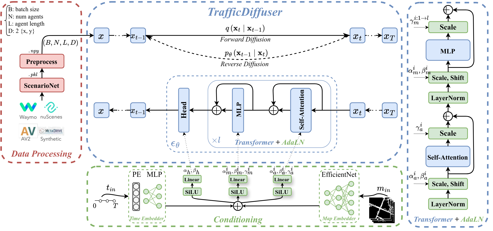
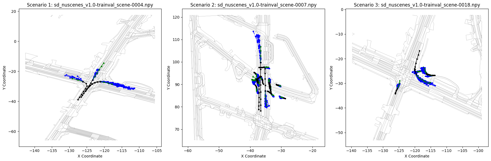

## The official PyTorch implementation of TrafficDiffuser <br><sub>Denoising Diffusion Model for Traffic Simulation</sub>
This project features a traffic simulation model for conditional trajectory generation using diffusion models. The model is capable of conditioning on agent histories and environmental maps, generating plausible trajectories for multiple agents with variable sequence length.



The repository is organized as follows:
  * [Documentation](#documentation)
  * [Folder Structure](#folder-structure)
  * [Setup](#setup)
  * [Data Processing](#data-processing)
  * [Training](#training)
  * [Sampling and Evaluation](#sampling-and-evaluation)

## Overview
TrafficDiffuser is a PyTorch-based implementation of a conditional trajectory generation model for traffic simulation. It leverages denoising diffusion models to simulate realistic traffic scenarios. 

## Documentation
* Refer to [ScenarioNet](https://github.com/metadriverse/scenarionet) to convert Nuscenes, Waymo, nuPlan, and Argoverse datasets into a unified dict format, which is required before training and evaluating TrafficDiffuser.
* The diffusion process is modified from OpenAI's diffusion repos: [GLIDE](https://github.com/openai/glide-text2im/blob/main/glide_text2im/gaussian_diffusion.py), [ADM](https://github.com/openai/guided-diffusion/blob/main/guided_diffusion), and [IDDPM](https://github.com/openai/improved-diffusion/blob/main/improved_diffusion/gaussian_diffusion.py).

## Folder Structure
``` 
traffic-diffuser-main/
├── assets/                            # Assets
├── configs/                           # Config files
├── docs/                              # Doc files
├── scripts/                           # Scripts for running tasks
│     ├── sample.py                    # Sampling script
│     ├── train.py                     # Training script
|     └── ...                          # Data preprocessing scripts
├── src/
|     ├── diffusion/                   # Core diffusion modules
|     ├── models/                      # Model and architecture components
|     └── utils/                       # Utility functions and helper scripts
├── README.md                          # Project overview, setup, and usage instructions
└── setup.py                           # Package installation
```

## Setup

First, download and set up the repo:

```bash
git clone https://github.com/gen-TII/traffic-diffuser.git
cd traffic-diffuser
```

Then, create a conda env and install the requirements

```bash
# Install TrafficDiffuser
conda create --name venv
conda activate venv
pip install -e .

# Install MetaDrive Simulator
git clone https://github.com/metadriverse/metadrive.git
cd metadrive
pip install -e.

# Install ScenarioNet
git clone https://github.com/metadriverse/scenarionet.git
cd scenarionet
pip install -e .
```

## Data Processing
First, convert and merge the original datasets (nuscenes, waymo, etc.) into unified dictionary-formatted pickle files using ScenarioNet. Next, preprocess these pickle files to generate the track and map directories in the required format. Follow the [`process_tracks.py`](scripts/process_tracks.py), [`process_maps.py`](scripts/process_maps.py), and [`process_closest_maps.py`](scripts/process_closest_maps.py) to perform the data processing steps on the desired datasets.


## Training
We provide a training script for TrafficDiffuser model in [`scripts/train.py`](scripts/train.py).

To launch TrafficDiffuser training with `N` GPUs on one node:
```bash
accelerate launch -m scripts.train --config configs/config_train.yaml
```

To launch TrafficDiffuser training with `1` GPU (id=1):
```bash
accelerate launch --num-processes=1 --gpu_ids 1 -m scripts.train --config configs/config_train.yaml
```


## Sampling and Evaluation
To sample trajectories from a pretrained TrafficDiffuser model, run:
```bash
python -m scripts.sample --config configs/config_sample.yaml
```

The sampling results are automatically saved in the model's designated experiments directory, organized within the samples subfolder for easy access. Additionally, evaluation metrics such as ADE (Average Displacement Error), FDE (Final Displacement Error), and MR (Miss Rate). The evaluation log file alse include the model summary, number of parameters, FLOPs, and inference runtime.

An example of the evaluation log file results:
```bash
...
The average evaluation results across test scenarios with :
- Average minADE_6=...
- Average minFDE_6=...
- Average MR=...
```

#### Visualization of test scenarios 4, 7 and 18:
