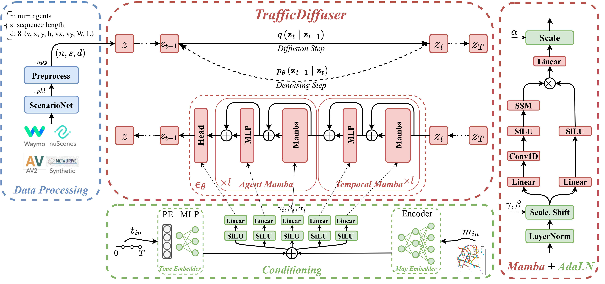

## The official PyTorch implementation of TrafficDiffuser <br><sub>Denoising Diffusion Model for Traffic Simulation</sub>
This project features a traffic simulation model for conditional trajectory generation using diffusion models.



The repository is organised as follows:
  * [Documentation](#documentation)
  * [Folder Structure](#folder-structure)
  * [Setup](#setup)
  * [Data Processing](#data-processing)
  * [Training](#training)
  * [Sampling](#sampling)
  * [Evaluation](#evaluation) 
 
## Documentation
* Refer to [ScenarioNet](https://github.com/metadriverse/scenarionet) to convert Nuscenes, Waymo, nuPlan, and Argoverse datasets into a unified dict format, if you want to train and evaluate on a merged dataset. 
* The diffusion process is modified from OpenAI's diffusion repos: [GLIDE](https://github.com/openai/glide-text2im/blob/main/glide_text2im/gaussian_diffusion.py), [ADM](https://github.com/openai/guided-diffusion/blob/main/guided_diffusion), and [IDDPM](https://github.com/openai/improved-diffusion/blob/main/improved_diffusion/gaussian_diffusion.py).
* Refer to [Vim](https://github.com/hustvl/Vim), as the official implementation of the paper [Vision Mamba: Efficient Visual Representation Learning with Bidirectional State Space Model](https://arxiv.org/abs/2401.09417).

## Folder Structure
``` 
traffic-diffuser-main
├── diffusion/                    # Diffusion dir
├── docs/asset                    # Documentation figures               
├── mamba/                        # Mamba model dir
├── models/                       # Backbones dir
│   └── layers.py                 # Layers and utility functions
│   └── model_td.py               # TrafficDiffuser backbone               
├── requirements.txt              # Requirements
├── sample.py                     # Sampling script 
└── train.py                      # Training script
```

## Setup

First, download and set up the repo:

```bash
git clone https://github.com/gen-TII/traffic-diffuser.git
cd traffic-diffuser
```

Then, create a python 3.10 conda env and install the requirements

```bash
conda create --name venv python=3.10
conda activate venv
pip install -r requirements.txt
cd mamba
pip install -e .
```

## Data Processing
First, we convert and merge the original datasets (nuscenes, waymo, etc.) into pickle files with a unified dictionary format, using ScenarioNet. Then, we used our preprocessing script to produce the data and map directories in the desired format. Specifically, we preprocess using [`preprocess_dataset.ipynb`](process_dataset.ipynb) to produce the numpy data and map (per scenario) directories. You will need to install [ScenarioNet](https://github.com/metadriverse/scenarionet).

## Training
We provide a training script for TrafficDiffuser model in [`train.py`](train.py).
To launch TrafficDiffuser-L training with `N` GPUs on one node:

```bash
accelerate launch --multi_gpu --num_processes N train.py --model TrafficDiffuser-L --data-path /path/to/preprocessed/scenarios/ --use-history --use-map --map-path /path/to/maps/
```

## Sampling

To sample from the EMA weights of a trained TrafficDiffuser-L model, run:

```bash
python sample.py --model TrafficDiffuser-L --ckpt /path/to/model.pt
```

The sampling results will be saved in the model results dir and inside samples dir.